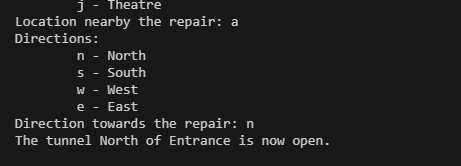

# MoleGuide Back-end

## Overview
The aim of this project is to implement back-end for Moleville tunnels network guide system. Given start and finish location this back-end is programmed to find shortest path(by time required) between start and finish location. This program also make sure that at given point of time tunnel between any x,y location is open or under maintanance.

---

## Assumptions
1. Each tunnel is from given location can be only four direction(east, west, north, south). Any other direction is not acccepted.
2. If any tunnel is put under maintenance it will be closed until user removes under maintenance flag from menu and while doing that user can't find shortest path.
3. Time taken between locations is always positive and in minutes
4. There is only one location in one direction. So there will not be 2 locations in same direction from current location.

---

## Solution Overview
1. **void initGuide()** 
-  Initialized MoleGuideMap all locations with their child location.
-  ```
    MoleGuideMap[Entrance]          = {{Slide, North, 2, false}, {Community_Centre, East, 3, false}};                       // a - Entrance
    MoleGuideMap[Slide]             = {{Entrance, East, 2, false}, {School, North, 2, false}, {Pool, South, 2, false}};     // b - Slide
    MoleGuideMap[School]            = {{Slide, South, 3, false}, {Playground, East, 1, false}};                             // c - School
    MoleGuideMap[Playground]        = {{Community_Centre, South, 2, false}};                                                // d - Playground
    MoleGuideMap[Community_Centre]  = {{Entrance, North, 3, false}, {Market, West, 1, false}};                              // e - Community Centre
    MoleGuideMap[Market]            = {{Public_Works, East, 1, false}};                                                     // f - Market
    MoleGuideMap[Public_Works]      = {{Community_Centre, North, 1, false},{Theatre, South, 1, false}};                     // g - Public Works
    MoleGuideMap[Pool]              = {{Market, East, 4, false}, {Museum, South, 1, false}};                                // h - Pool
    MoleGuideMap[Museum]            = {{Theatre, East, 2, false}};                                                          // i - Museum
    MoleGuideMap[Theatre]           = {{School, East, 5, false}, {Museum, South, 3, false}};                                // j - Theatre
    ```
2. **const Route& findRoute(Location start, Location finish)**: 
- This function will finds shortest time route.
- Uses Dijkstra's algorithm with priority queue(To minimize time complexity) to find the shortest path.
- dist map stores shortest distance from `Location start` algorithm have seen in iterations.
- prev map stores path from its parent location in iteration.
- Any under construction flag will ignore that tunnel in that iteration.
- Construct waypointes starting from finish to start using prev map.
- Reverse that waypoints since we need it from start to end
- If dist array for finish location is stil Infinity means we haven't found any path from algorithm and it will return nullptr and num waypoints will be 0.
- Properly construct route varible and return it.

3. **int reportCaveIn(Location nearby, Direction direction)**
- This function will make ``isUnderMaintenance`` variable true for specific tunnel.
- tunnel is idetified using location and its direction. Since there is only one tunnel going between two locations.

4. **int reportCaveInCleared(Location nearby, Direction direction)**
- This function will make ``isUnderMaintenance`` variable false for specific tunnel.
- tunnel is idetified using location and its direction. Since there is only one tunnel going between two locations.

---

## Testing and Varification
- The solution is tested on various test cases manually and using unit test given in file ```TestMolevilleGuide.cpp```
1. **Normal Test Cases**:
   - Tested the `initGuide` function to ensure the graph was initialized correctly.
   - Verified that `findRoute` returns the correct shortest path for various start and end locations.
   - Tested `reportCaveIn` and `reportCaveInCleared` to ensure tunnels are correctly marked as closed or open.
   - 
   - 
   - 
   - Now Tunnel between Slide and Entrance is closed for maintenance
   - 
   - 
   - Now Tunnel between Slide and Entrance is open
   - 
   - 

2. **Edge Cases**:
   - Tested scenarios where no path exists between 2 locations
   - Closed both tunnels from Entrace to Slide and Entrance to Community Centre
   - 

3. **Automatic Test case run**
   - There is one file ``TestMolevilleGuide.cpp`` to run automated test.
   - 

---

## Enhancements
If more time were available, the following enhancements could be made:
1. **Try Different Route finding algorithm**: 
- In this version Dijkstra's Algorithm with priority queue is used to find best route between location.
- There are also different algorithm like Bellman-Ford, A, BFS to find best route.
- Could have implemented this using above mentioned algorithms.
2. **Calculating Time and Memory Usage**: 
- In this version I have not calculated exact time and memory usage of the program.
- Although Dijkstra's Algorithm's time complexity is O((V+E)logV) where V is number of locations(edges) and E is number of edges(Tunnels).
3. **UI**: 
- Current version is all consol based application. Can make it more apealing to user by adding graphical user interface.
4. **Build system**
- I have compiled this program using my own build system(mingw64) on my pc since I was having some issue compiling with gradle.
- If I had more time I would have dig deeper into compilation issues with gradle(Somehow my interface.lib file was missing when linking).
---